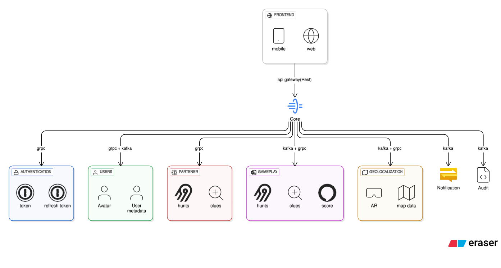

Architecture
============

This is a detailed page about the architecture of the lootopia project

MicroArcitecture
----------------
We have decided to implment a micro architecture, this will mean every service will be seperated into
a module. this has many benafits like better mantaniblity and better fault tolerace, in order to this we will breka the project up into
the following modules:

Backend
~~~~~~~

- core
- authentication
- users
- partener
- hunt
- gameplay
- geolocalization
- api(data tansfere objects)

Frontend
~~~~~~~~

- mobile
- web

Cloudflaire
-----------
this is the dns provider it will be used as the dns as well as the loadbalencer
in order to fight againt DDOS attacks and host our website so that it can be accsed worldwide

Kuberneties
-----------
this will be used to set up the three enviroments dev, int, and production,
for each enviroment we will have a cluster, this will be deployed using helm 
with github action and jira deployment tracking

.. note::
   The dev and intgration enviroments will be deployed using a jekins job but this is not for sure yet

Docker
------
we will use docker as well as docker compose for one, synchronization of the devloper enviroments and
two for the docker build file capcity in oder to quickly be able to deploy

Apache Kafka
------------
We will use apache kafka in order to be able to asynchronysly manage requests coming from all the different microservices
we will use this for its message que and event capaity allowing us to be able to make game envents
as well as notification events

Redis
-----
Redis will be used in order to cache data and in return make it quicker to fetch data
i am mainly thinking about implmenting this in geolocalization features, in order for data to be fetched rapidly

Databases
---------
Each service will have its own database

- Postgresql
  - this will be used to stock structed data like users names and emails
- Neo4j
  - this will be used to stock cordiants and paths to clues beacuase of vectors it is perfect for the job
- ImmoDb
  - this will be used for services where the data should be immutable like the authentication service
- Object storage
  - this will be used to stock images and non structered data
- OpenSearch
  - this will be used to stock the audit logs in order to make quick and easy debuging

